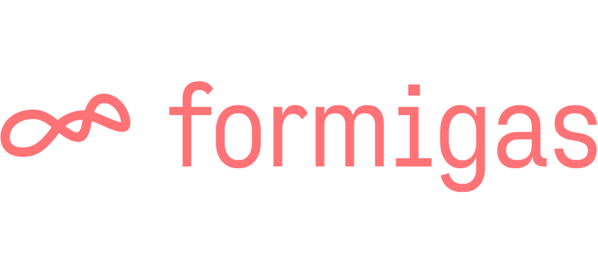

# Hey, we‘re formigas …

… a tech-driven innovation studio based in Konstanz 🇩🇪 and Zurich 🇨🇭. We partner with pioneering companies to design, build and scale our digital future.

On Github, we want to share our knowledge through helpful repos 👇

## Our open source tools

- 🧱[**formigas Flutter Bricks**](https://github.com/formigas/formigas-flutter-bricks), our framework for an effortless project setup and fast development process

At formigas, we use those tools on a daily basis 👇

## **Check out our client work**

**Cross-platform**

- 🧘 [**homodea Meditation**](https://apps.apple.com/de/app/homodea-meditation/id1640042438) & 📱[**homodea**](https://apps.apple.com/de/app/homodea/id6473463334), two flutter apps for life design coach Veit Lindau, sharing a common package
- 🔋 [**chargeBIG**](https://apps.apple.com/de/app/chargebig/id1495948606), a flutter app for charging cars, making any other physical interaction obsolete (certified by German Eichamt)
- 🔦 [**Lupine Light Control**](https://apps.apple.com/de/app/lupine-light-control-3-0/id1582228436), a flutter app for managing (and controlling) high-end bicycle lightning
- 🤖 **horstOS**, an Android Custom ROM with apps, for managing a entry-level industry robot on a tablet

**Web**

- 🫧 **Elma Hub**, a customer-facing cloud platform with product specific services
- 🚿 [**Sprinz Konfigurator**,](https://www.sprinz.eu/index.php?Duschenwelt-3D-Duschenkonfigurator) a web-3d app to design your custom shower solution

**Vision & AI**

- ⚙️ **fruitcore Co-Pilot**, a custom LLM for setting up, programming and trouble-shooting a entry-level industry robot

## Curious about us?

If you want to know more about our projects, our work or even our culture, feel free to reach out!

- 🌐 [**Website**](https://formigas.io/)
- 🤝 [**Linkedin**](https://www.linkedin.com/company/formigas-gmbh/)
